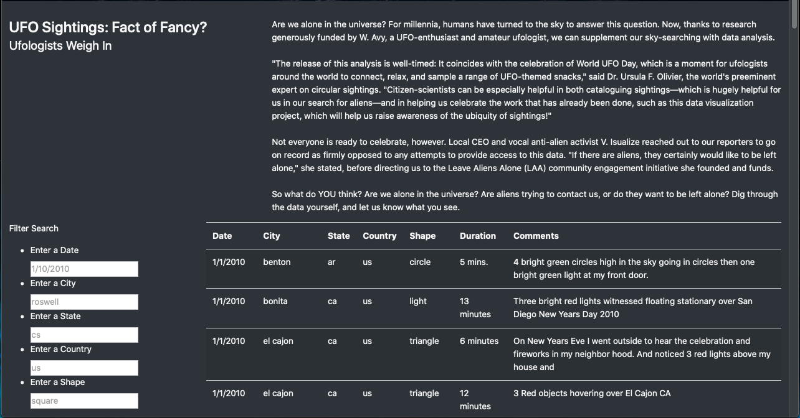
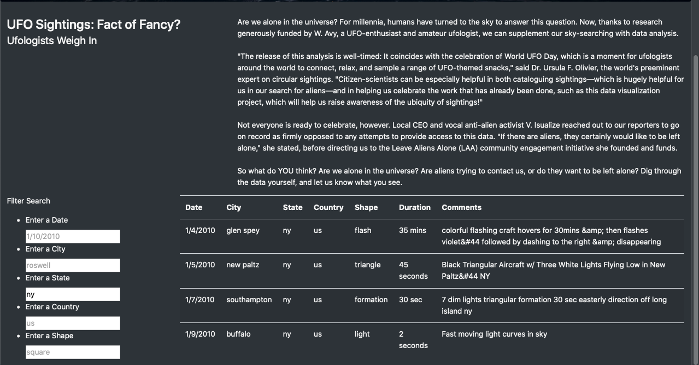

# UFOs
Christopher Padilla Gregorio
10/11/2020

# Overview 
  The point of the project is expand the website that has been created before by adding additional filter criteria. This would allow the user to search for data based on its state, city, country, and shape. 

# Results 
  Once the html has readjusted to add the additional filter criteria. An user may type the following information to any of the search bars (City, Country, State, and Shape) to search for a particular information about certain area. This will be demostrated a few images below. 
  

The image above contains all the data without a single filter written. 

The image above conatains information about UFO sightings in New York state.

# Summary 
  Users can successfully search for there desired information with filtered criteria. However, the information provided is restricted from January 1st 2010 to January 13 2010. Any date after the 13th will result in a page appearing with no information. Recommendations that I would make is that the data for the website be constantly updated to show the newest sightings and a "County" or "Town" filter to be added to further understand where the information had came from. 
